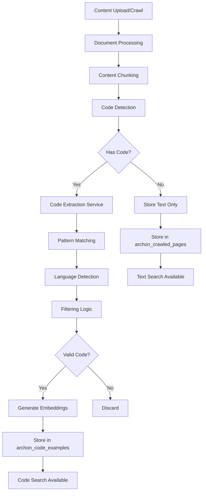

# Code Extraction Architecture

This document provides a comprehensive overview of Archon's code extraction system architecture, implementation details, and integration points.

## System Overview

The code extraction system is responsible for identifying, extracting, and storing code examples from crawled content to enable semantic code search functionality.



## Core Components

### 1. Code Extraction Service

**Location:** `python/src/server/services/crawling/code_extraction_service.py`

**Primary Responsibilities:**
- Extract code blocks from markdown and HTML content
- Apply filtering logic to distinguish code from documentation
- Generate embeddings for code examples
- Store processed code in the database

**Key Methods:**
```python
async def extract_and_store_code_examples(
    crawl_results: list[dict],
    url_to_full_document: dict[str, str],
    progress_callback: Callable = None
) -> int
```

### 2. Code Storage Service

**Location:** `python/src/server/services/storage/code_storage_service.py`

**Primary Responsibilities:**
- Low-level code block extraction from content
- Pattern matching for various code block formats
- Content validation and filtering
- Database storage operations

**Key Functions:**
```python
def extract_code_blocks(
    markdown_content: str, 
    min_length: int = None
) -> list[dict[str, Any]]

async def add_code_examples_to_supabase(
    client: Client,
    urls: list[str],
    code_examples: list[str],
    # ... other parameters
)
```

### 3. Document Storage Operations

**Location:** `python/src/server/services/crawling/document_storage_operations.py`

**Integration Point:**
- Orchestrates the complete document processing pipeline
- Calls code extraction service during crawling workflow
- Manages progress tracking and error handling

## Extraction Pipeline

### Phase 1: Content Analysis (0-40% progress)

1. **Document Iteration:** Process each crawled document
2. **Content Type Detection:** Identify markdown vs HTML content
3. **Pattern Matching:** Apply extraction patterns based on content type
4. **Initial Filtering:** Remove obvious non-code content

### Phase 2: Code Processing (40-80% progress)

1. **Language Detection:** Identify programming language from code blocks
2. **Content Validation:** Apply filtering rules to ensure quality
3. **Summary Generation:** Create AI-powered descriptions (if enabled)
4. **Metadata Preparation:** Structure data for storage

### Phase 3: Storage (80-100% progress)

1. **Embedding Generation:** Create vector embeddings for semantic search
2. **Database Insertion:** Store in `archon_code_examples` table
3. **Progress Reporting:** Update crawl progress status
4. **Cleanup:** Remove temporary data and complete processing

## Pattern Matching System

### Supported Code Block Formats

The system recognizes multiple code block formats across different platforms:

#### Markdown Formats
```markdown
```python
def example():
    return "code"
```
```

#### HTML Formats
- **GitHub/GitLab:** `<div class="highlight">` patterns
- **Docusaurus:** `<div class="codeBlockContainer">` patterns
- **Prism.js:** `<pre class="language-*">` patterns
- **Monaco Editor:** `<div class="monaco-editor">` patterns
- **CodeMirror:** `<div class="cm-content">` patterns

#### Platform-Specific Patterns
- **Nextra:** `<div data-nextra-code>` patterns
- **VitePress:** `<div class="vp-code-group">` patterns
- **Milkdown:** `<div class="milkdown">` patterns

### Language Detection

The system automatically detects programming languages through:

1. **Explicit Language Tags:** ````python`, `<code class="language-javascript">`
2. **Content Analysis:** Syntax patterns and keywords
3. **File Extension Context:** When available in surrounding content
4. **Fallback Detection:** Heuristic analysis for unlabeled code

## Filtering Logic

### Content Quality Filters

#### 1. Length Validation
- **Minimum Length:** Configurable (default: 250 characters)
- **Maximum Length:** Configurable (default: 5000 characters)
- **Contextual Adjustment:** Dynamic minimums based on content type

#### 2. Prose Detection
Filters out documentation text disguised as code blocks:

```python
# Prose indicators
doc_indicators = [
    ("this ", "that ", "these ", "those "),  # Articles
    ("is ", "are ", "was ", "were "),        # Verbs
    "for example:", "note:", "warning:",     # Documentation
    ". ", "? ", "! "                         # Sentence endings
]
```

#### 3. Code Pattern Validation
Ensures content contains actual code patterns:

```python
code_patterns = [
    "=", "(", ")", "{", "}", "[", "]", ";",
    "function", "def", "class", "import",
    "->", "=>", "==", "!=", "<=", ">="
]
```

#### 4. Diagram Filtering
**Critical Component:** Distinguishes between legitimate code and ASCII art diagrams.

**⚠️ Recent Fix (2025-08-23):** Improved diagram filtering to prevent false positives with directory tree structures.

**Directory Tree Preservation:**
```python
# Intelligent detection for bash/shell directory trees
is_directory_tree = (
    language in ["bash", "shell", "sh", "zsh", "fish", "cmd", "powershell", "ps1"] and
    any(indicator in content for indicator in ["├", "└", "│", "─"]) and
    any(pattern in content.lower() for pattern in ["/", "\\", ".py", ".js", ".ts", ".md", ".sql", ".txt", ".json", ".yml", ".yaml", ".sh"])
)
```

**Enhanced Diagram Detection:**
- **Excluded from bash/shell:** Tree characters (`├`, `└`, `│`, `─`) when file extensions detected
- **Box drawing chars:** `┌`, `┐`, `┘`, `┤`, `┬`, `┴`, `┼` (still filtered)
- **ASCII art patterns:** `+-+`, `|_|`, `___`
- **Arrow symbols:** `→`, `←`, `↑`, `↓`
- **Increased thresholds:** 8+ diagram indicators (was 5+), 5+ special char lines (was 3+)

**Problem Solved:** Previously, legitimate bash directory trees were incorrectly classified as ASCII art diagrams and filtered out, preventing code extraction. The fix adds intelligent detection to preserve directory structures while still filtering actual diagrams.

### Configuration Settings

All filtering behavior is configurable through the `archon_settings` table:

| Setting | Purpose | Impact |
|---------|---------|---------|
| `MIN_CODE_BLOCK_LENGTH` | Quality threshold | Higher = fewer, higher-quality extractions |
| `ENABLE_PROSE_FILTERING` | Documentation filtering | Reduces false positives |
| `ENABLE_DIAGRAM_FILTERING` | ASCII art filtering | Prevents diagram extraction |
| `MAX_PROSE_RATIO` | Prose tolerance | Lower = stricter code validation |
| `MIN_CODE_INDICATORS` | Code pattern threshold | Higher = stricter validation |

## Database Schema

### archon_code_examples Table

```sql
CREATE TABLE archon_code_examples (
    id BIGSERIAL PRIMARY KEY,
    url VARCHAR NOT NULL,
    chunk_number INTEGER NOT NULL,
    content TEXT NOT NULL,           -- The extracted code
    summary TEXT NOT NULL,           -- AI-generated summary
    metadata JSONB NOT NULL,         -- Language, context, etc.
    source_id TEXT NOT NULL,         -- Foreign key to sources
    embedding VECTOR(1536),          -- Semantic search vector
    created_at TIMESTAMP DEFAULT NOW(),
    
    UNIQUE(url, chunk_number),
    FOREIGN KEY (source_id) REFERENCES archon_sources(source_id)
);
```

### Metadata Structure

```json
{
    "chunk_index": 0,
    "url": "file://example.md",
    "source_id": "file_example_md_123456",
    "language": "python",
    "char_count": 450,
    "word_count": 67,
    "example_name": "Data Processing Function",
    "title": "Data Processing Function"
}
```

## Integration Points

### 1. Crawling Workflow

Code extraction is integrated into the main crawling pipeline:

```python
# In crawling_service.py
if request.get("extract_code_examples", True):
    code_examples_count = await self.doc_storage_ops.extract_and_store_code_examples(
        crawl_results,
        storage_results["url_to_full_document"],
        code_progress_callback,
        85, 95  # Progress range: 85-95%
    )
```

### 2. Search Integration

Code examples are searchable through dedicated endpoints:

- **API Endpoint:** `POST /api/rag/code-search`
- **MCP Tool:** `search_code_examples`
- **UI Component:** Code search interface

### 3. Embedding Integration

Code examples use the same embedding service as regular content:

- **Provider:** Configurable (OpenAI, TEI, etc.)
- **Dimensions:** 1536 (OpenAI) or configurable
- **Context:** Code content + summary for better semantic matching

## Performance Considerations

### Optimization Strategies

1. **Batch Processing:** Process multiple code blocks in parallel
2. **Caching:** Cache extraction patterns and settings
3. **Streaming:** Process large documents in chunks
4. **Async Operations:** Non-blocking embedding generation

### Resource Management

- **Memory:** Limit concurrent extractions to prevent OOM
- **CPU:** Configurable worker threads for parallel processing
- **Database:** Batch insertions to reduce connection overhead
- **Network:** Efficient embedding API usage

### Monitoring Metrics

- **Extraction Rate:** Percentage of code blocks successfully extracted
- **Processing Time:** Average time per code block
- **Storage Efficiency:** Ratio of extracted vs. total code content
- **Search Quality:** Relevance of code search results

## Error Handling

### Common Error Scenarios

1. **Extraction Failures:** Malformed code blocks, encoding issues
2. **Storage Errors:** Database connection issues, constraint violations
3. **Embedding Failures:** API rate limits, service unavailability
4. **Memory Issues:** Large code blocks, concurrent processing limits
5. **Filtering Issues:** Legitimate code filtered as diagrams or prose

### Recovery Mechanisms

- **Retry Logic:** Exponential backoff for transient failures
- **Graceful Degradation:** Continue processing other content on failures
- **Error Logging:** Detailed logging for debugging and monitoring
- **Partial Success:** Store successfully processed code even if some fails

## Troubleshooting Guide

### Issue: Code Examples Not Being Extracted

**Symptoms:**
- `search_code_examples` returns empty results
- `archon_code_examples` table is empty
- Content shows `has_code: true` but no extraction occurs

**Diagnostic Steps:**

1. **Verify Content Processing:**
```bash
# Check if content is being indexed
curl -X POST "http://localhost:8080/api/rag/query" \
  -H "Content-Type: application/json" \
  -d '{"query": "your content", "match_count": 3}'
```

2. **Check Code Detection:**
Look for `"has_code": true` in RAG query metadata.

3. **Verify Database State:**
```sql
-- Check total code examples
SELECT COUNT(*) FROM archon_code_examples;

-- Check recent crawled pages
SELECT COUNT(*) FROM archon_crawled_pages WHERE created_at > NOW() - INTERVAL '1 hour';
```

4. **Test Code Extraction Settings:**
```sql
-- Check extraction configuration
SELECT key, value FROM archon_settings WHERE category = 'code_extraction';
```

**Common Solutions:**

1. **Directory Tree Filtering (Fixed 2025-08-23):**
   - **Problem:** Bash directory trees filtered as ASCII art
   - **Solution:** Updated filtering logic to preserve directory structures
   - **Verification:** Recrawl sources with bash directory trees

2. **Minimum Length Issues:**
   - **Problem:** Code blocks below minimum length threshold
   - **Solution:** Adjust `MIN_CODE_BLOCK_LENGTH` setting
   - **Default:** 250 characters

3. **Service Restart Required:**
   - **Problem:** Code changes not loaded
   - **Solution:** Restart archon-server service
   - **Verification:** Check service logs for updated filtering logic

4. **Configuration Issues:**
   - **Problem:** Code extraction disabled
   - **Solution:** Verify `extract_code_examples: true` in crawl requests
   - **Check:** Review crawl request parameters

### Issue: Recrawl Error Messages (August 2025 Investigation)

**Symptoms:**
- Users see old error messages despite successful deployment
- Error format: `"Failed to retrieve file content for refresh: 400: {'error': 'No content found for file source...'}"`
- Both development and production environments affected

**Root Cause Analysis:**
```
Error Flow:
1. Old HTTPException raised → "No content found for file source..."
2. Exception handler catches it (knowledge_api.py:353-363)
3. str(e) converts to → "400: {'error': 'No content found...'}"
4. Handler wraps it → "Failed to retrieve file content for refresh: 400: {'error': '...'}"
```

**Investigation Status:**
- ✅ **Deployment Verified**: Latest code running in containers
- ✅ **New Error Messages**: Improved error handling deployed
- ✅ **Error Pattern Identified**: HTTPException wrapping detected
- 🔄 **In Progress**: Finding remaining old HTTPException source

**Resolution Strategy:**
1. **Systematic Search**: Find remaining old error message locations
2. **Database Functions**: Check Supabase stored procedures/functions
3. **Call Stack Tracing**: Identify exact source of nested HTTPException
4. **Complete Fix**: Update all remaining old error message sources

**Temporary Workaround:**
Users experiencing recrawl errors should try re-uploading the file instead of using the refresh button until the remaining error source is identified and fixed.

## Future Enhancements

### Planned Improvements

1. **Advanced Language Detection:** ML-based language identification
2. **Code Quality Scoring:** Rank code examples by complexity/usefulness
3. **Semantic Clustering:** Group related code examples
4. **Cross-Reference Detection:** Link code examples to documentation
5. **Real-time Processing:** Stream-based extraction for large repositories

### Extensibility Points

- **Custom Extractors:** Plugin system for new code formats
- **Language Handlers:** Specialized processing for specific languages
- **Quality Filters:** Custom validation rules for different domains
- **Storage Backends:** Alternative storage systems for code examples

## Related Documentation

- [Knowledge Base Troubleshooting](./knowledge-base-troubleshooting.mdx)
- [Code Extraction Rules](./code-extraction-rules.mdx)
- [API Reference](./api-reference.mdx)
- [Configuration Guide](./configuration.mdx)
