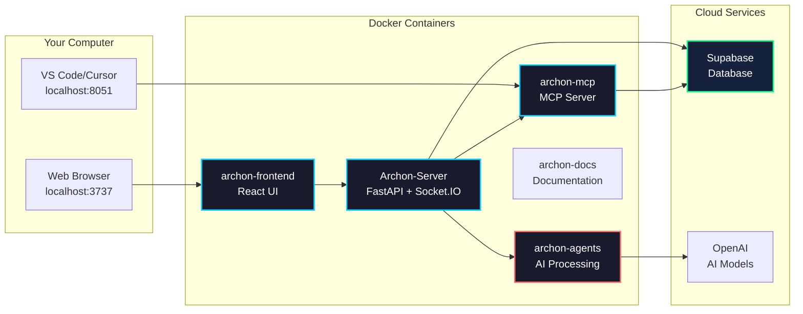

import Tabs from '@theme/Tabs';
import TabItem from '@theme/TabItem';
import Admonition from '@theme/Admonition';

# Deployment

## Quick Start

<Admonition type="tip" title="Prerequisites">
- Docker and Docker Compose installed
- Supabase account (free tier works)
- Git for cloning the repository
</Admonition>

### 1. Clone & Setup

```bash
# Clone repository
git clone <repository-url>
cd archon

# Create environment file
cp .env.example .env
```

### 2. Configure

Edit `.env` with your credentials:

```bash
SUPABASE_URL=https://your-project.supabase.co
SUPABASE_SERVICE_KEY=eyJ0eXAi...
```

### 3. Launch

```bash
# Start all services
docker-compose up -d

# Check status
docker-compose ps
```

### 4. Access

- **UI**: http://localhost:3737
- **API Docs**: http://localhost:8080/docs
- **Documentation**: http://localhost:3838

## Jenkins CI/CD Pipeline

### Jenkins Access & Credentials
- **URL**: `http://hl-jenkins.techpad.uk:8080/job/archon-plus/job/main/`
- **Username**: `jenkins`
- **Password**: `P0w3rPla72012@@`
- **Status**: ✅ Accessible and functional

### Automated Deployment Process
The Jenkins pipeline automatically:
1. **Builds** Docker images on git push to main branch
2. **Tags** images with build number and git commit hash
3. **Pushes** to Harbor registry (`hl-harbor.techpad.uk/archon`)
4. **Attempts** automatic dev deployment (may require manual completion)

### Dev-First Deployment Workflow (MANDATORY)

**🚨 CRITICAL: Always deploy to development environment first, then promote to production after verification.**

#### Step 1: Deploy to Development Environment
When Jenkins build succeeds but deployment requires manual action:

```bash
# Check Jenkins build status
curl -u "jenkins:P0w3rPla72012@@" -s "http://hl-jenkins.techpad.uk:8080/job/archon-plus/job/main/lastBuild/api/json" | jq -r '.number, .result'

# Deploy to development environment FIRST
docker service update --force archon-dev_dev-archon-server
docker service update --force archon-dev_dev-archon-ui
docker service update --force archon-dev_dev-archon-mcp
docker service update --force archon-dev_dev-archon-agents

# Verify dev deployment
docker service ls | grep archon-dev
```

#### Step 2: Test Development Environment
```bash
# Test dev API health
curl -s "http://10.202.70.20:9181/health" | jq .

# Test dev UI accessibility
curl -I "http://10.202.70.20:4737" 2>/dev/null | head -2

# Test specific functionality (example: knowledge base API)
curl -s "http://10.202.70.20:9181/api/knowledge-items" | jq '.items[0:2]'

# Verify all dev services healthy
docker service ps archon-dev_dev-archon-server --format "table {{.Name}}\t{{.CurrentState}}"
```

#### Step 3: Deploy to Production (Only After Dev Verification)
```bash
# ONLY proceed if dev environment is stable and tested
# Deploy to production environment
docker service update --force archon_archon-server
docker service update --force archon_archon-ui
docker service update --force archon_archon-mcp
docker service update --force archon_archon-agents

# Verify production deployment
docker service ls | grep -E "archon_"
```

#### Step 4: Verify Production Environment
```bash
# Test production API health
curl -s "http://10.202.70.20:8181/health" | jq .

# Test production UI accessibility
curl -I "http://10.202.70.20:3737" 2>/dev/null | head -2

# Verify all production services healthy
docker service ps archon_archon-server --format "table {{.Name}}\t{{.CurrentState}}"
```

### Environment URLs
- **Development**:
  - UI: http://10.202.70.20:4737
  - API: http://10.202.70.20:9181
- **Production**:
  - UI: http://10.202.70.20:3737
  - API: http://10.202.70.20:8181

### Deployment Checklist

Use this checklist to ensure proper dev-first deployment:

#### ✅ Pre-Deployment
- [ ] Jenkins build completed successfully
- [ ] Latest Docker images available in Harbor registry
- [ ] No critical issues in development environment
- [ ] Backup/rollback plan prepared if needed

#### ✅ Development Deployment
- [ ] Deploy to dev environment (`archon-dev_*` services)
- [ ] Verify all dev services healthy (1/1 replicas)
- [ ] Test dev API endpoints (`http://10.202.70.20:9181`)
- [ ] Test dev UI functionality (`http://10.202.70.20:4737`)
- [ ] Verify specific feature functionality
- [ ] Check logs for any errors or warnings

#### ✅ Production Deployment (Only After Dev Success)
- [ ] Deploy to production environment (`archon_*` services)
- [ ] Verify all production services healthy (1/1 replicas)
- [ ] Test production API endpoints (`http://10.202.70.20:8181`)
- [ ] Test production UI functionality (`http://10.202.70.20:3737`)
- [ ] Monitor for any errors or performance issues
- [ ] Update deployment documentation if needed

#### ✅ Post-Deployment
- [ ] Notify team of successful deployment
- [ ] Update task status in project management
- [ ] Document any lessons learned
- [ ] Monitor system for 24 hours for stability

### Emergency Rollback Procedures

If issues are discovered after deployment, use these rollback procedures:

#### Quick Rollback (Previous Image)
```bash
# Get previous image ID from service history
docker service ps archon_archon-server --format "table {{.Name}}\t{{.Image}}\t{{.CurrentState}}"

# Rollback to previous version (example)
docker service update --rollback archon_archon-server
docker service update --rollback archon_archon-ui

# Verify rollback successful
docker service ls | grep archon_
```

#### Specific Image Rollback
```bash
# Rollback to specific image tag
docker service update --image hl-harbor.techpad.uk/archon/archon-server:BUILD_NUMBER archon_archon-server
docker service update --image hl-harbor.techpad.uk/archon/archon-ui:BUILD_NUMBER archon_archon-ui

# Verify specific version deployed
docker service inspect archon_archon-server --format '{{.Spec.TaskTemplate.ContainerSpec.Image}}'
```

### Alternative Production Deployment Options
1. **Portainer UI**: Navigate to `http://10.202.70.20:9000` → Stacks → archon → Update
2. **Pipeline Script**: `./portainer-templates/pipeline-deploy.sh deploy prod ${IMAGE_TAG}`
3. **Manual Stack**: `docker stack deploy -c portainer-templates/archon-saas-supabase-prod.yml archon`

### Best Practices Summary

1. **🚨 ALWAYS**: Deploy to development first, test thoroughly, then promote to production
2. **⏱️ TIMING**: Allow sufficient time for testing in development environment
3. **📊 MONITORING**: Monitor both environments for at least 24 hours post-deployment
4. **🔄 ROLLBACK**: Have rollback plan ready before starting production deployment
5. **📝 DOCUMENTATION**: Update deployment logs and notify team of changes
6. **🧪 TESTING**: Test critical user journeys in both environments
7. **⚡ ZERO-DOWNTIME**: Use `docker service update --force` for rolling updates

## Hot Module Reload (HMR)

<Admonition type="tip" title="Built-in Hot Reload">
Archon automatically includes Hot Module Reload for both Python server and React UI. Code changes are reflected immediately without container rebuilds.
</Admonition>

### What Changes Without Rebuild

<Tabs>
<TabItem value="python" label="Python Server">

**✅ No Rebuild Required:**
- Python source code changes (`.py` files)
- Configuration changes in code
- Business logic updates
- API endpoint modifications
- Socket.IO event handlers
- Service layer changes

**❌ Rebuild Required:**
- New pip dependencies in `requirements.*.txt`
- System package installations
- Dockerfile modifications
- Environment variable changes in docker-compose

</TabItem>
<TabItem value="frontend" label="React UI">

**✅ No Rebuild Required:**
- React components (`.tsx`, `.jsx`)
- CSS/Tailwind styles
- TypeScript code
- Static assets in `public/`
- Vite configuration (most changes)

**❌ Rebuild Required:**
- New npm dependencies in `package.json`
- Node version changes
- Build tool configurations
- Environment variable changes

</TabItem>
</Tabs>

### How HMR Works

**Python Server:**
- Uses `uvicorn --reload`
- Watches file changes automatically
- Restarts on save
- WebSocket connections re-establish after reload

**React UI:**
- Vite's built-in HMR
- Component state preserved when possible
- CSS updates without page reload
- Fast refresh for React components

### Tips

1. **Monitor Logs**: Watch for reload messages
   ```bash
   docker logs -f Archon-Server
   ```

2. **Handle Disconnects**: The UI shows a disconnect screen during server reload

3. **State Persistence**: Server state resets on reload, but database state persists

<Admonition type="warning" title="MCP Service Note">
The MCP service doesn't support hot reload. Restart manually after changes:
```bash
docker-compose restart archon-mcp
```
</Admonition>

## Service Architecture



## Common Commands

<Tabs>
<TabItem value="basic" label="Basic Operations">

```bash
# Start services
docker-compose up -d

# Stop services
docker-compose down

# View logs
docker-compose logs -f

# Restart a service
docker-compose restart archon-frontend
```

</TabItem>
<TabItem value="troubleshooting" label="Troubleshooting">

```bash
# Check container status
docker ps

# View service logs
docker logs archon-server
docker logs archon-mcp
docker logs archon-agents

# Rebuild after changes
docker-compose build
docker-compose up -d

# Complete reset
docker-compose down -v
docker-compose up -d --build
```

</TabItem>
</Tabs>

## Advanced Configuration

<Admonition type="info" title="Scaling Archon">
For team deployments, consider:
- Using a reverse proxy (nginx/Caddy) for multiple users
- Setting up SSL certificates for secure connections
- Configuring resource limits based on usage
- Using managed Supabase instances
</Admonition>

## Database Management

### Reset Database

<Admonition type="warning" title="Data Loss Warning">
This will delete ALL data in your database!
</Admonition>

```sql
-- Run in Supabase SQL editor
-- migration/RESET_DB.sql
```

### Backup Data

```bash
# Export data before reset
pg_dump -h your-db-host -U postgres -d postgres > backup.sql
```

## Monitoring

### Health Checks

```bash
# API Health
curl http://localhost:8080/health

# Check all services
echo "Frontend: http://localhost:3737"
curl -s http://localhost:3737 > /dev/null && echo "✓ Running" || echo "✗ Not running"

echo "API: http://localhost:8080/health"
curl -s http://localhost:8080/health | jq '.status' || echo "✗ Not running"

echo "MCP: http://localhost:8051/sse"
curl -s http://localhost:8051/sse > /dev/null && echo "✓ Running" || echo "✗ Not running"

echo "Agents: http://localhost:8052/health"
curl -s http://localhost:8052/health | jq '.status' || echo "✗ Not running"
```

### Container Resources

```bash
# View resource usage
docker stats

# Check disk usage
docker system df
```

## Next Steps

<Admonition type="success" title="Ready to Go!">
Your Archon instance is now running. Next:

1. **Set up API keys** in Settings
2. **Configure MCP** for AI agents
3. **Start crawling** knowledge sources
4. **Create projects** and tasks
</Admonition> 