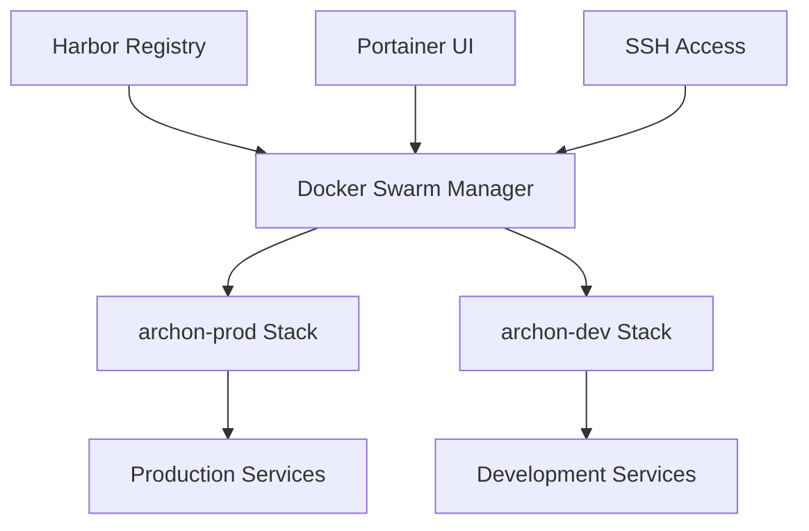

# Portainer & Docker Swarm Management

This guide covers the complete workflow for managing Archon deployments using Portainer and Docker Swarm, including service updates, stack management, and troubleshooting procedures.

## Overview

Archon uses Docker Swarm for orchestration with Portainer as the management interface:

- **archon-prod**: Production environment managed via Portainer
- **archon-dev**: Development environment managed via Portainer  
- **Local testing**: Development machine (hl-dev-lnx-01)

## Environment Architecture



### Service Endpoints

| Environment | Portainer | Services | SSH Access |
|-------------|-----------|----------|------------|
| **archon-prod** | Portainer UI | Various ports | 10.202.70.20 |
| **archon-dev** | Portainer UI | Port 9181 (server) | 10.202.70.20 |
| **Local** | N/A | Port 8080 (server) | hl-dev-lnx-01 |

## Portainer Management

### Accessing Portainer

1. **Navigate to Portainer UI**
2. **Select Environment**: Choose the appropriate Docker Swarm environment
3. **Access Stacks**: Go to "Stacks" section for stack management

### Stack Operations

#### Viewing Stack Status

1. Navigate to **Stacks** in Portainer
2. Locate your stack (e.g., `archon-dev`, `archon-prod`)
3. Check service status indicators:
   - 🟢 **Green**: All services healthy
   - 🟡 **Yellow**: Some services updating/starting
   - 🔴 **Red**: Services failed or unhealthy

#### Updating a Stack

**Method 1: Portainer UI Update**

1. **Select Stack**: Click on the stack name
2. **Editor View**: Click "Editor" tab
3. **Update Configuration**: Modify docker-compose.yml if needed
4. **Update Stack**: Click "Update the stack"
5. **Options**:
   - ☑️ **Pull and redeploy**: Force pull latest images
   - ☑️ **Re-pull image**: Update images even if tags haven't changed

**Method 2: Git Repository Update**

1. **Select Stack**: Click on the stack name
2. **Git Configuration**: Ensure repository settings are correct
3. **Update from Git**: Click "Update from Git repository"
4. **Force Update**: Enable if you want to force pull latest changes

### Service Management

#### Viewing Service Details

1. **Navigate to Services**: Go to "Services" section
2. **Select Service**: Click on service name (e.g., `archon-dev_dev-archon-server`)
3. **View Details**:
   - **Tasks**: Running containers and their status
   - **Logs**: Service logs and output
   - **Constraints**: Placement and resource constraints

#### Updating Individual Services

1. **Select Service**: Click on the service name
2. **Update Service**: Click "Update service" button
3. **Configuration Options**:
   - **Image**: Update to new image tag
   - **Force Update**: Redeploy even if no changes
   - **Rollback**: Revert to previous version

## Command Line Management

### SSH Access Setup

```bash
# SSH credentials for Docker Swarm manager
HOST="10.202.70.20"
USER="paddy"
PASSWORD="P0w3rPla72012@@"

# Using sshpass for automated access
sshpass -p 'P0w3rPla72012@@' ssh -o StrictHostKeyChecking=no paddy@10.202.70.20
```

### Docker Swarm Commands

#### Service Management

```bash
# List all services
docker service ls

# List services for specific stack
docker service ls --filter label=com.docker.stack.namespace=archon-dev

# View service details
docker service ps <service-id>

# View service logs
docker service logs <service-id> --tail 50

# Update service with latest image
docker service update --force --image <image-name> <service-id>
```

#### Stack Management

```bash
# List all stacks
docker stack ls

# View stack services
docker stack services <stack-name>

# Remove stack (careful!)
docker stack rm <stack-name>

# Deploy stack from compose file
docker stack deploy -c docker-compose.yml <stack-name>
```

### Service Update Examples

#### Force Update archon-dev Server

```bash
# Connect to swarm manager
sshpass -p 'P0w3rPla72012@@' ssh -o StrictHostKeyChecking=no paddy@10.202.70.20

# Find the service
docker service ls | grep archon-dev

# Update the server service
docker service update --force --image hl-harbor.techpad.uk/archon/archon-server:latest hvdujoo2getr
```

#### Update All Services in Stack

```bash
# Update all services in archon-dev stack
for service in $(docker service ls --filter label=com.docker.stack.namespace=archon-dev --format "{{.ID}}"); do
    docker service update --force $service
done
```

## Harbor Registry Integration

### Image Management

The services pull images from Harbor registry:

- **Registry**: `hl-harbor.techpad.uk`
- **Images**: 
  - `archon/archon-server:latest`
  - `archon/archon-mcp:latest`
  - `archon/archon-agents:latest`
  - `archon/archon-ui:latest`

### Force Image Updates

When code changes are pushed, the Harbor registry builds new images. To ensure services use the latest:

```bash
# Force pull and update (recommended)
docker service update --force --image hl-harbor.techpad.uk/archon/archon-server:latest <service-id>

# Alternative: Update with --force flag
docker service update --force <service-id>
```

## Troubleshooting

### Common Issues

#### 1. Service Stuck in Updating State

**Symptoms**: Service shows "Updating" for extended period

**Solution**:
```bash
# Check service status
docker service ps <service-id> --no-trunc

# If stuck, force rollback
docker service rollback <service-id>

# Or remove and redeploy
docker service rm <service-id>
# Then redeploy via Portainer or stack
```

#### 2. Image Pull Failures

**Symptoms**: "image could not be accessed on registry"

**Solutions**:
```bash
# Check registry connectivity
docker pull hl-harbor.techpad.uk/archon/archon-server:latest

# Force update without registry check
docker service update --force <service-id>

# Check Harbor registry status
curl -I https://hl-harbor.techpad.uk
```

#### 3. Container Health Check Failures

**Symptoms**: Services showing unhealthy status

**Diagnosis**:
```bash
# Check container logs
docker service logs <service-id> --tail 100

# Check specific container
docker ps --filter label=com.docker.swarm.service.name=<service-name>
docker logs <container-id>

# Check health endpoint
curl http://<service-ip>:<port>/health
```

### Service Recovery Procedures

#### Complete Service Restart

```bash
# Method 1: Scale down and up
docker service scale <service-id>=0
sleep 10
docker service scale <service-id>=1

# Method 2: Force update
docker service update --force <service-id>

# Method 3: Remove and redeploy
docker service rm <service-id>
# Redeploy via Portainer stack update
```

#### Stack Recovery

```bash
# Remove entire stack
docker stack rm <stack-name>

# Wait for cleanup
sleep 30

# Redeploy stack
docker stack deploy -c docker-compose.yml <stack-name>
```

## Best Practices

### Update Workflow

1. **Test Locally**: Always test changes on local environment first
2. **Update Dev**: Deploy to archon-dev for testing
3. **Verify Functionality**: Run comprehensive tests
4. **Update Production**: Deploy to archon-prod after verification
5. **Monitor**: Watch logs and health checks post-deployment

### Monitoring

```bash
# Watch service status
watch 'docker service ls'

# Monitor specific service
watch 'docker service ps <service-id>'

# Follow logs in real-time
docker service logs -f <service-id>
```

### Backup Considerations

- **Configuration**: Backup docker-compose.yml files
- **Data Volumes**: Ensure persistent data is backed up
- **Database**: Regular database backups for Supabase data
- **Registry**: Harbor registry should have backup procedures

## Quick Reference

### Essential Commands

```bash
# Service status
docker service ls
docker service ps <service-id>

# Update service
docker service update --force <service-id>

# View logs
docker service logs <service-id> --tail 50

# Stack operations
docker stack ls
docker stack services <stack-name>

# Health checks
curl http://<host>:<port>/health
```

### Service IDs Reference

| Service | Environment | Service ID | Port |
|---------|-------------|------------|------|
| archon-server | archon-dev | hvdujoo2getr | 9181 |
| archon-mcp | archon-dev | nizrruo5eprp | 9051 |
| archon-agents | archon-dev | mz1ip7odqrtc | 9052 |
| archon-ui | archon-dev | ijxwyfssm1om | 4737 |

*Note: Service IDs may change after updates. Use `docker service ls` to get current IDs.*

## Related Documentation

- [Code Extraction Architecture](./code-extraction-architecture.mdx)
- [Knowledge Base Troubleshooting](./knowledge-base-troubleshooting.mdx)
- [Server Deployment](./server-deployment.mdx)
- [Configuration Guide](./configuration.mdx)
