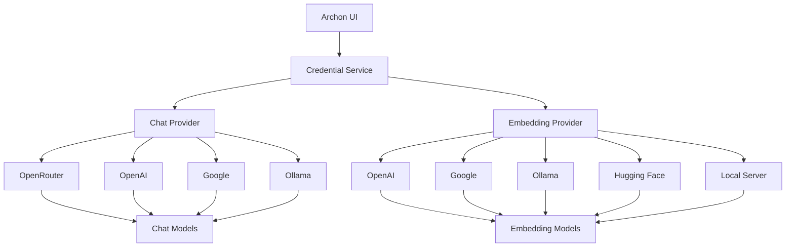

# Split Provider Architecture

Archon v2.0 introduces **Split Provider Architecture**, allowing you to use different providers for chat/LLM and embedding models. This enables powerful combinations like using OpenRouter for chat while leveraging OpenAI's embeddings, or running local Ollama for chat with cloud-based embeddings.

## Overview

### What are Split Providers?

Split providers allow you to configure:
- **Chat Provider**: Handles LLM/chat model requests (OpenAI, Google, OpenRouter, Ollama)
- **Embedding Provider**: Handles text embedding requests (OpenAI, Google, Ollama, Hugging Face, Local)

This separation provides:
- **Cost Optimization**: Use cheaper providers for embeddings, premium for chat
- **Performance Tuning**: Optimize each service type independently
- **Hybrid Deployments**: Mix local and cloud providers
- **Provider Specialization**: Use best-in-class providers for each task

### Architecture Diagram



## Provider Support Matrix

| Provider | Chat Support | Embedding Support | API Key Required | Default Base URL |
|----------|-------------|------------------|------------------|------------------|
| **OpenAI** | ✅ | ✅ | Yes | Default |
| **Google Gemini** | ✅ | ✅ | Yes | `https://generativelanguage.googleapis.com/v1beta/openai/` |
| **OpenRouter** | ✅ | ❌ | Yes | `https://openrouter.ai/api/v1` |
| **Ollama** | ✅ | ✅ | No | `http://localhost:11434/v1` |
| **Hugging Face** | ❌ | ✅ | Yes | `https://api-inference.huggingface.co/models` |
| **Local Server** | ❌ | ✅ | Optional | `http://localhost:8080` |

## Configuration Fields

### New Database Fields

```sql
-- Split Provider Configuration
CHAT_PROVIDER: 'openrouter' | 'openai' | 'google' | 'ollama'
EMBEDDING_PROVIDER: 'openai' | 'google' | 'ollama' | 'huggingface' | 'local'

-- Service-Specific Base URLs
CHAT_BASE_URL: Custom base URL for chat provider
EMBEDDING_BASE_URL: Custom base URL for embedding provider

-- Additional API Keys
OPENROUTER_API_KEY: OpenRouter API key
HUGGINGFACE_API_KEY: Hugging Face API key
LOCAL_EMBEDDING_API_KEY: Local server API key (if required)
```

### Backward Compatibility

The system maintains full backward compatibility:
- **LLM_PROVIDER**: Still supported, used as fallback for both chat and embedding
- **LLM_BASE_URL**: Used as fallback if service-specific URLs not set
- **Existing API Keys**: Continue to work without changes

## Common Use Cases

### 1. Cost-Optimized Setup
**OpenRouter for Chat + OpenAI for Embeddings**
```yaml
CHAT_PROVIDER: "openrouter"
EMBEDDING_PROVIDER: "openai"
MODEL_CHOICE: "anthropic/claude-3.5-sonnet"
EMBEDDING_MODEL: "text-embedding-3-small"
```

### 2. Privacy-First Setup
**All Local with Ollama + TEI**
```yaml
CHAT_PROVIDER: "ollama"
EMBEDDING_PROVIDER: "local"
CHAT_BASE_URL: "http://ollama:11434/v1"
EMBEDDING_BASE_URL: "http://tei-container:8080"
MODEL_CHOICE: "llama3.2:3b"
EMBEDDING_MODEL: "all-MiniLM-L6-v2"
```

### 3. Hybrid Cloud-Local
**Google Chat + Local Embeddings**
```yaml
CHAT_PROVIDER: "google"
EMBEDDING_PROVIDER: "local"
MODEL_CHOICE: "gemini-1.5-flash"
EMBEDDING_BASE_URL: "http://embedding-server:8080"
```

### 4. Enterprise Setup
**OpenAI Chat + Hugging Face Embeddings**
```yaml
CHAT_PROVIDER: "openai"
EMBEDDING_PROVIDER: "huggingface"
MODEL_CHOICE: "gpt-4o-mini"
EMBEDDING_MODEL: "sentence-transformers/all-mpnet-base-v2"
```

## Configuration via UI

### RAG Settings Interface

The RAG Settings page now features separate provider selection:

1. **Chat Provider Dropdown**: Select provider for LLM/chat models
2. **Embedding Provider Dropdown**: Select provider for embedding models
3. **Service-Specific Base URLs**: Configure custom endpoints when needed
4. **Model Configuration**: Set models for each provider independently

### Provider-Specific Features

- **Conditional Base URLs**: Only shown for providers that support custom endpoints
- **Smart Placeholders**: Model suggestions based on selected provider
- **Validation**: Real-time validation of provider combinations

## API Integration

### Credential Service

```python
# Get chat provider configuration
chat_config = await credential_service.get_active_provider("llm")
# Returns: provider, api_key, base_url, model

# Get embedding provider configuration  
embedding_config = await credential_service.get_active_provider("embedding")
# Returns: provider, api_key, base_url, model

# Set providers independently
await credential_service.set_active_provider("openrouter", "llm")
await credential_service.set_active_provider("huggingface", "embedding")
```

### LLM Provider Service

```python
# Get chat client (uses CHAT_PROVIDER)
async with get_llm_client() as chat_client:
    response = await chat_client.chat.completions.create(...)

# Get embedding client (uses EMBEDDING_PROVIDER)
async with get_llm_client(use_embedding_provider=True) as embedding_client:
    embeddings = await embedding_client.embeddings.create(...)

# Get embedding model (provider-specific default)
model = await get_embedding_model()
```

## Migration Path

### Automatic Migration

When upgrading to v2.0:
1. **Database Migration**: Runs automatically on startup
2. **Configuration Preservation**: Existing LLM_PROVIDER values populate new fields
3. **Zero Downtime**: No service interruption during migration
4. **Rollback Safe**: Can revert to previous version if needed

### Manual Migration Steps

For custom configurations:

1. **Backup Current Settings**
   ```bash
   # Export current configuration
   docker exec Archon-Server python -c "
   from src.server.services.credential_service import credential_service
   import asyncio
   async def export():
       settings = await credential_service.get_credentials_by_category('rag_strategy')
       print(settings)
   asyncio.run(export())
   "
   ```

2. **Configure Split Providers**
   - Navigate to RAG Settings in UI
   - Select desired Chat Provider
   - Select desired Embedding Provider
   - Configure base URLs if needed
   - Save settings

3. **Verify Configuration**
   ```bash
   # Test chat functionality
   curl -X POST http://localhost:8181/api/chat/sessions \
     -H "Content-Type: application/json" \
     -d '{"title": "Test Chat"}'

   # Test embedding functionality
   curl -X POST http://localhost:8181/api/knowledge/items \
     -H "Content-Type: application/json" \
     -d '{"content": "Test content", "source": "test"}'
   ```

## Troubleshooting

### Common Issues

**1. Provider Mismatch Errors**
```
Error: Embedding provider 'openrouter' not supported for embeddings
```
**Solution**: OpenRouter only supports chat. Use OpenAI, Google, Ollama, Hugging Face, or Local for embeddings.

**2. Missing API Keys**
```
Error: Hugging Face API key not found
```
**Solution**: Add the required API key in RAG Settings or environment variables.

**3. Connection Failures**
```
Error: Connection refused to http://localhost:8080
```
**Solution**: Verify local server is running and base URL is correct.

### Fallback Behavior

The system uses this fallback chain:
1. **Service-specific provider** (CHAT_PROVIDER/EMBEDDING_PROVIDER)
2. **Legacy provider** (LLM_PROVIDER)
3. **System defaults** (openrouter for chat, openai for embedding)

### Debug Commands

```bash
# Check current provider configuration
docker exec Archon-Server python -c "
from src.server.services.credential_service import credential_service
import asyncio
async def debug():
    chat = await credential_service.get_active_provider('llm')
    embedding = await credential_service.get_active_provider('embedding')
    print(f'Chat: {chat}')
    print(f'Embedding: {embedding}')
asyncio.run(debug())
"

# Test provider connectivity
docker exec Archon-Server python -c "
from src.server.services.llm_provider_service import get_llm_client
import asyncio
async def test():
    async with get_llm_client() as client:
        print('Chat client created successfully')
    async with get_llm_client(use_embedding_provider=True) as client:
        print('Embedding client created successfully')
asyncio.run(test())
"
```

## Best Practices

### Provider Selection

1. **Chat Providers**: Choose based on model quality and cost
   - **OpenRouter**: Access to multiple models, competitive pricing
   - **OpenAI**: High quality, reliable, higher cost
   - **Google**: Good performance, competitive pricing
   - **Ollama**: Local, private, free (requires local setup)

2. **Embedding Providers**: Choose based on performance and cost
   - **OpenAI**: High quality embeddings, moderate cost
   - **Google**: Good quality, competitive pricing
   - **Hugging Face**: Many model options, pay-per-use
   - **Local**: Free, private, requires setup

### Performance Optimization

1. **Latency**: Use geographically close providers
2. **Throughput**: Consider rate limits and concurrent connections
3. **Cost**: Balance quality vs. cost for your use case
4. **Reliability**: Have fallback providers configured

### Security Considerations

1. **API Keys**: Store securely, rotate regularly
2. **Local Servers**: Secure network access, use authentication
3. **Data Privacy**: Consider data residency requirements
4. **Monitoring**: Log provider usage and errors

## Next Steps

- [Migration Guide](./split-providers-migration.mdx) - Detailed migration instructions
- [Provider Combinations](./provider-combinations.mdx) - Specific setup examples
- [Configuration Reference](./configuration.mdx) - Complete configuration options
