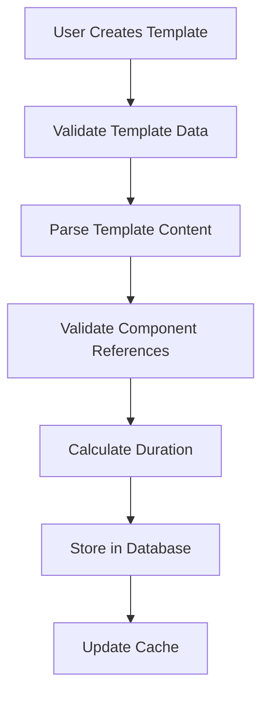
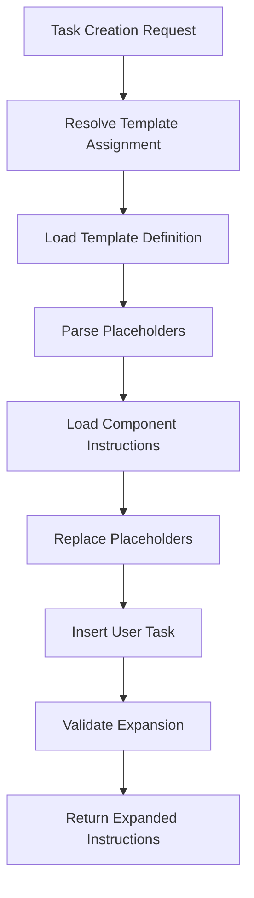
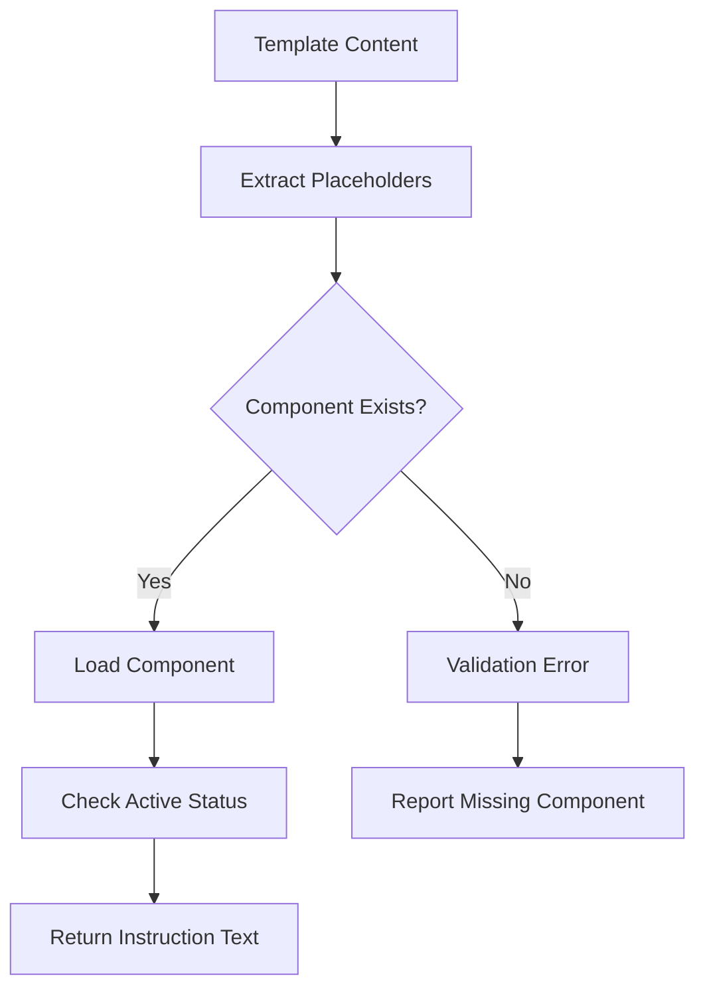

# Template Object Structure Analysis

## Executive Summary

Archon implements a sophisticated multi-layered template system with three distinct but interconnected template architectures:

1. **Template Injection System** - Workflow automation with component placeholders
2. **Template Definition System** - Component-based project templates  
3. **Template Components** - Reusable instruction blocks

This analysis documents the complete object structures, relationships, and data flows across all template systems.

## 1. Template Injection System

### 1.1 Core Architecture

The Template Injection System provides workflow automation by injecting standardized operational procedures around user tasks.

#### Database Schema: `archon_template_injection_templates`

```sql
CREATE TABLE archon_template_injection_templates (
  id UUID PRIMARY KEY DEFAULT gen_random_uuid(),
  name VARCHAR(255) UNIQUE NOT NULL,           -- e.g., "workflow_default"
  description TEXT DEFAULT '',
  template_type template_injection_type NOT NULL DEFAULT 'workflow',
  injection_level template_injection_level NOT NULL DEFAULT 'task',
  
  -- Template content with {{placeholder}} variables
  template_content TEXT NOT NULL,              -- Template with {{group::name}} placeholders
  user_task_position INTEGER DEFAULT 6,       -- Where {{USER_TASK}} appears in sequence
  
  -- Metadata and configuration
  estimated_duration INTEGER DEFAULT 30,      -- Total estimated duration in minutes
  required_tools JSONB DEFAULT '[]'::jsonb,   -- MCP tools needed
  applicable_phases JSONB DEFAULT '["development", "testing", "deployment"]'::jsonb,
  
  -- Status and versioning
  is_active BOOLEAN DEFAULT true,
  version VARCHAR(50) DEFAULT '1.0.0',
  author VARCHAR(255) DEFAULT 'archon-system',
  
  created_at TIMESTAMPTZ DEFAULT NOW(),
  updated_at TIMESTAMPTZ DEFAULT NOW()
);
```

#### Python Model: `TemplateDefinition`

```python
class TemplateDefinition(BaseModel):
    # Basic Information
    id: Optional[UUID] = None
    name: str = Field(..., min_length=1, max_length=255)
    title: str = Field(..., min_length=1)
    description: str = ""
    template_type: TemplateDefinitionType = TemplateDefinitionType.PROJECT
    
    # Template Content and Configuration
    template_data: Dict[str, Any] = Field(..., description="Template configuration and content as JSONB")
    parent_template_id: Optional[UUID] = None
    inheritance_level: int = Field(default=0, ge=0, le=3)
    
    # Categorization
    category: str = "general"
    tags: List[str] = []
    
    # Status and Access
    is_public: bool = True
    is_active: bool = True
    created_by: str
    
    # Timestamps
    created_at: Optional[datetime] = None
    updated_at: Optional[datetime] = None
```

#### TypeScript Interface: `TemplateDefinition`

```typescript
export interface TemplateDefinition {
  id?: string;                                 // UUID - optional for creation
  name: string;                               // min_length=1, max_length=255
  title: string;                              // min_length=1, max_length=500
  description: string;                        // default=""
  
  template_type: TemplateType;                // default=TemplateType.PERSONAL
  status: TemplateStatus;                     // default=TemplateStatus.DRAFT
  
  parent_template_id?: string;                // UUID - optional
  inheritance_rules: Record<string, any>;    // JSONB field - default={}
  
  workflow_assignments: Record<string, any>; // JSONB field - default={}
  component_templates: Record<string, any>;  // JSONB field - default={}
  
  is_active: boolean;                         // default=true
  is_public: boolean;                         // default=false
  
  created_by: string;                         // default="system"
  usage_count: number;                        // default=0
  
  created_at?: string;                        // ISO datetime string
  updated_at?: string;                        // ISO datetime string
}
```

### 1.2 Template Data Structure

The `template_data` JSONB field contains the core template configuration:

```json
{
  "version": "1.1.0",
  "required_tools": [
    "view", 
    "homelab-vault", 
    "str-replace-editor", 
    "launch-process", 
    "read-terminal", 
    "manage_task_archon-prod"
  ],
  "injection_level": "task",
  "template_content": "{{group::understand_homelab_env}}\n\n{{group::guidelines_coding}}\n\n{{group::naming_conventions}}\n\n{{group::testing_strategy}}\n\n{{group::documentation_strategy}}\n\n{{USER_TASK}}\n\n{{group::create_tests}}\n\n{{group::test_locally}}\n\n{{group::commit_push_to_git}}\n\n{{group::check_jenkins_build}}\n\n{{group::send_task_to_review}}",
  "applicable_phases": ["planning", "development", "testing", "deployment", "maintenance"],
  "estimated_duration": 73,
  "user_task_position": 6
}
```

## 2. Template Components System

### 2.1 Core Architecture

Template Components are reusable instruction blocks that can be referenced in templates using placeholder syntax like `{{group::component_name}}`.

#### Database Schema: `archon_template_components`

```sql
CREATE TABLE archon_template_components (
  id UUID PRIMARY KEY DEFAULT gen_random_uuid(),
  name VARCHAR(255) UNIQUE NOT NULL,           -- e.g., "group::understand_homelab_env"
  description TEXT DEFAULT '',
  component_type template_component_type NOT NULL DEFAULT 'group',
  
  -- Component instruction content
  instruction_text TEXT NOT NULL,              -- Full expanded instruction text
  
  -- Requirements and metadata
  required_tools JSONB DEFAULT '[]'::jsonb,   -- MCP tools needed
  estimated_duration INTEGER DEFAULT 5,       -- Duration in minutes
  input_requirements JSONB DEFAULT '{}'::jsonb,
  output_expectations JSONB DEFAULT '{}'::jsonb,
  validation_criteria JSONB DEFAULT '[]'::jsonb,
  
  -- Categorization and metadata
  category VARCHAR(100) DEFAULT 'general',
  priority VARCHAR(20) DEFAULT 'medium',      -- low, medium, high, critical
  tags JSONB DEFAULT '[]'::jsonb,
  
  is_active BOOLEAN DEFAULT true,
  created_at TIMESTAMPTZ DEFAULT NOW(),
  updated_at TIMESTAMPTZ DEFAULT NOW()
);
```

#### Python Model: `TemplateComponent`

```python
class TemplateComponent(BaseModel):
    # Basic Information
    id: Optional[UUID] = None
    name: str = Field(..., min_length=1, max_length=255)
    description: str = ""
    component_type: TemplateComponentType = TemplateComponentType.GROUP
    
    # Component Content
    instruction_text: str = Field(..., min_length=1)
    
    # Requirements and Metadata
    required_tools: List[str] = []
    estimated_duration: int = Field(default=5, ge=1)
    input_requirements: Dict[str, Any] = {}
    output_expectations: Dict[str, Any] = {}
    validation_criteria: List[str] = []
    
    # Categorization and Metadata
    category: str = Field(default="general", max_length=100)
    priority: str = "medium"
    tags: List[str] = []
    
    # Status
    is_active: bool = True
    
    # Timestamps
    created_at: Optional[datetime] = None
    updated_at: Optional[datetime] = None
```

### 2.2 Component Types

```python
class TemplateComponentType(str, Enum):
    ACTION = "action"       # Single atomic instruction (e.g., action::git_commit)
    GROUP = "group"         # Related set of instructions (e.g., group::testing_strategy)
    SEQUENCE = "sequence"   # Ordered workflow segment (e.g., sequence::deployment)
```

### 2.3 Component Naming Convention

Components follow a strict naming pattern: `{type}::{name}`

Examples:
- `group::understand_homelab_env`
- `group::guidelines_coding`
- `group::testing_strategy`
- `action::git_commit`
- `sequence::deployment`

## 3. Template Assignment System

### 3.1 Core Architecture

Template assignments link templates to specific hierarchy levels (project, milestone, phase, task, subtask).

#### Database Schema: `archon_template_assignments`

```sql
CREATE TABLE archon_template_assignments (
  id UUID PRIMARY KEY DEFAULT gen_random_uuid(),
  
  -- Polymorphic reference to hierarchy level
  hierarchy_type template_hierarchy_type NOT NULL,
  hierarchy_id UUID NOT NULL,
  
  -- Template assignment
  template_id UUID REFERENCES archon_template_injection_templates(id) ON DELETE CASCADE,
  
  -- Assignment configuration
  assignment_context JSONB DEFAULT '{}'::jsonb,
  priority INTEGER DEFAULT 0,
  conditional_logic JSONB DEFAULT '{}'::jsonb,
  
  -- Status and metadata
  is_active BOOLEAN DEFAULT true,
  assigned_at TIMESTAMPTZ DEFAULT NOW(),
  assigned_by VARCHAR(255) DEFAULT 'system',
  
  created_at TIMESTAMPTZ DEFAULT NOW(),
  updated_at TIMESTAMPTZ DEFAULT NOW(),
  
  UNIQUE(hierarchy_type, hierarchy_id, template_id)
);
```

#### Python Model: `TemplateAssignment`

```python
class TemplateAssignment(BaseModel):
    id: Optional[UUID] = None
    
    # Polymorphic Reference
    hierarchy_type: HierarchyType
    hierarchy_id: UUID
    
    # Template Assignment
    template_id: Optional[UUID] = None
    
    # Assignment Configuration
    assignment_context: Dict[str, Any] = {}
    priority: int = 0
    conditional_logic: Dict[str, Any] = {}
    injection_level: TemplateInjectionLevel = TemplateInjectionLevel.TASK
    
    # Status and Metadata
    is_active: bool = True
    assigned_at: Optional[datetime] = None
    assigned_by: str = "system"
    
    # Timestamps
    created_at: Optional[datetime] = None
    updated_at: Optional[datetime] = None
```

### 3.2 Hierarchy Types

```python
class HierarchyType(str, Enum):
    PROJECT = "project"
    MILESTONE = "milestone"
    PHASE = "phase"
    TASK = "task"
    SUBTASK = "subtask"
```

### 3.3 Injection Levels

```python
class TemplateInjectionLevel(str, Enum):
    PROJECT = "project"      # Applied to all tasks in project
    MILESTONE = "milestone"  # Applied to milestone completion tasks
    PHASE = "phase"         # Applied to development phase tasks
    TASK = "task"           # Applied to individual tasks
    SUBTASK = "subtask"     # Applied to granular operations
```

## 4. Template Expansion System

### 4.1 Expansion Process

Template expansion replaces placeholders with actual component instructions:

1. **Parse Template**: Extract `{{placeholder}}` patterns from template content
2. **Resolve Components**: Look up each component by name in `archon_template_components`
3. **Expand Instructions**: Replace placeholders with component `instruction_text`
4. **Position User Task**: Insert original user task at `user_task_position`
5. **Validate Result**: Ensure all placeholders were resolved

### 4.2 Expansion Result Model

```python
class TemplateExpansionResult(BaseModel):
    # Original Data
    original_task: str
    template_name: str
    
    # Expansion Results
    expanded_instructions: str
    template_metadata: Dict[str, Any] = {}
    
    # Performance Metrics
    expansion_time_ms: int = Field(..., ge=0)
    component_count: int = Field(default=0, ge=0)
    
    # Validation Results
    validation_passed: bool = True
    validation_warnings: List[str] = []
    
    # Context
    project_id: Optional[UUID] = None
    task_id: Optional[UUID] = None
    
    # Timestamp
    expanded_at: datetime = Field(default_factory=datetime.now)
```

## 5. Integration with Task System

### 5.1 Task Template Metadata

Tasks store template expansion metadata in the `template_metadata` JSONB column:

```sql
ALTER TABLE archon_tasks 
ADD COLUMN template_metadata JSONB DEFAULT '{}'::jsonb;
```

### 5.2 Template Metadata Structure

```json
{
  "template_name": "workflow_default",
  "original_description": "Implement OAuth2 authentication",
  "expanded_at": "2025-08-24T10:30:00Z",
  "expansion_time_ms": 45,
  "component_count": 10,
  "preserve_original": true,
  "template_version": "1.1.0"
}
```

## 6. API Integration Patterns

### 6.1 MCP Tool Integration

Templates are managed through MCP tools:

- `manage_template_injection` - Template CRUD operations
- `manage_template_components` - Component CRUD operations  
- `expand_template_preview` - Preview template expansion

### 6.2 Service Layer Architecture

```
Frontend (ComponentsTab)
    ↓
templateService.ts (MCP-based)
    ↓
/api/mcp/tools/call → manage_template_injection
    ↓
template_injection_module.py
    ↓
HTTP calls to /api/template-injection/*
    ↓
Template Services & Database
```

## 7. Current Implementation Status

### 7.1 Completed Components

✅ **Database Schema**: Complete with all tables and indexes
✅ **Python Models**: Complete Pydantic models with validation
✅ **TypeScript Types**: Complete interface definitions
✅ **Template Components**: 10 operational components created
✅ **Default Template**: `workflow_default` template operational

### 7.2 Incomplete Components

⚠️ **MCP Tool Actions**: Only "create" and "list" implemented, missing "get", "update", "delete", "validate"
❌ **REST API Endpoints**: Missing `/api/template-injection/*` endpoints
❌ **Template Expansion**: `expand_template_preview` not functional
❌ **Template Resolver**: Incomplete hierarchy resolution logic

## 8. Recommendations

### 8.1 Immediate Actions

1. **Complete MCP Tool Implementation**: Add missing actions (get, update, delete, validate)
2. **Implement REST API Endpoints**: Create `/api/template-injection/*` endpoints
3. **Fix Template Expansion**: Implement working `expand_template_preview` functionality
4. **Add Template Resolver**: Complete hierarchy-based template resolution

### 8.2 Future Enhancements

1. **Template Inheritance**: Implement parent-child template relationships
2. **Conditional Logic**: Add support for conditional component inclusion
3. **Template Versioning**: Implement semantic versioning for templates
4. **Performance Optimization**: Add caching for template resolution
5. **Template Analytics**: Track template usage and effectiveness metrics

## 9. Data Flow Analysis

### 9.1 Template Creation Flow



### 9.2 Template Expansion Flow



### 9.3 Component Resolution Flow



## 10. Example Template Structures

### 10.1 Complete Template Example

```json
{
  "id": "7cd7c536-3075-470e-a6ab-91cd45a7f862",
  "name": "workflow_default",
  "title": "Default Template Injection Workflow",
  "description": "Standard operational workflow for most development tasks",
  "template_type": "project",
  "template_data": {
    "version": "1.1.0",
    "required_tools": [
      "view", "homelab-vault", "str-replace-editor",
      "launch-process", "read-terminal", "manage_task_archon-prod"
    ],
    "injection_level": "task",
    "template_content": "{{group::understand_homelab_env}}\n\n{{group::guidelines_coding}}\n\n{{group::naming_conventions}}\n\n{{group::testing_strategy}}\n\n{{group::documentation_strategy}}\n\n{{USER_TASK}}\n\n{{group::create_tests}}\n\n{{group::test_locally}}\n\n{{group::commit_push_to_git}}\n\n{{group::check_jenkins_build}}\n\n{{group::send_task_to_review}}",
    "applicable_phases": ["planning", "development", "testing", "deployment", "maintenance"],
    "estimated_duration": 73,
    "user_task_position": 6
  },
  "category": "template-injection",
  "tags": ["workflow", "default", "template-injection", "operational"],
  "is_public": true,
  "is_active": true,
  "created_by": "archon-system",
  "created_at": "2025-08-20T22:30:43.929681+00:00",
  "updated_at": "2025-08-20T23:05:24.443519+00:00"
}
```

### 10.2 Complete Component Example

```json
{
  "id": "5e6ad4e6-38b6-4aeb-ae7c-c5a69843b629",
  "name": "group::understand_homelab_env",
  "description": "Review homelab environment and available services",
  "component_type": "group",
  "instruction_text": "Before starting implementation, review the homelab environment and available services:\n\n1. **Review Homelab Documentation**: Use the `view` tool to examine any relevant homelab documentation in the project\n2. **Check Available Services**: Use the `homelab-vault` MCP tool to understand available credentials and services\n3. **Understand Network Topology**: Review network configuration and deployment targets\n4. **Identify Dependencies**: Determine what services, databases, or infrastructure components this task depends on\n5. **Verify Access**: Ensure you have the necessary credentials and access to required systems\n\nThis context will inform your implementation approach and help avoid conflicts with existing infrastructure.",
  "required_tools": ["view", "homelab-vault"],
  "estimated_duration": 8,
  "input_requirements": {},
  "output_expectations": {},
  "validation_criteria": [],
  "category": "preparation",
  "priority": "high",
  "tags": ["homelab", "infrastructure", "preparation"],
  "is_active": true,
  "created_at": "2025-08-20T22:27:17.51638+00:00",
  "updated_at": "2025-08-20T22:27:17.51638+00:00"
}
```

### 10.3 Template Assignment Example

```json
{
  "id": "assignment-uuid",
  "hierarchy_type": "project",
  "hierarchy_id": "project-uuid",
  "template_id": "7cd7c536-3075-470e-a6ab-91cd45a7f862",
  "assignment_context": {
    "environment": "development",
    "team": "backend",
    "complexity": "medium"
  },
  "priority": 10,
  "conditional_logic": {
    "conditions": [
      {
        "field": "task.feature",
        "operator": "equals",
        "value": "authentication"
      }
    ],
    "logic": "AND"
  },
  "injection_level": "task",
  "is_active": true,
  "assigned_at": "2025-08-20T22:30:00.000Z",
  "assigned_by": "archon-system"
}
```

## 11. Validation and Error Handling

### 11.1 Template Validation Rules

1. **Name Uniqueness**: Template names must be unique across the system
2. **Component References**: All `{{placeholder}}` references must exist as components
3. **User Task Position**: `user_task_position` must be valid within template content
4. **Tool Requirements**: All `required_tools` must be valid MCP tool names
5. **Duration Calculation**: Total duration must match sum of component durations

### 11.2 Component Validation Rules

1. **Name Format**: Must follow `{type}::{name}` pattern
2. **Type Consistency**: Component type in name must match `component_type` field
3. **Instruction Content**: `instruction_text` cannot be empty
4. **Priority Values**: Must be one of: low, medium, high, critical
5. **Tool References**: All `required_tools` must be valid MCP tool names

### 11.3 Error Response Structure

```json
{
  "success": false,
  "error": "Template validation failed",
  "details": {
    "validation_errors": [
      "Template references unknown component: {{group::nonexistent}}",
      "user_task_position (15) exceeds template content length (10)"
    ],
    "error_code": "TEMPLATE_VALIDATION_ERROR",
    "timestamp": "2025-08-24T10:30:00Z"
  }
}
```

## 12. Performance Considerations

### 12.1 Database Indexes

Critical indexes for performance:

```sql
-- Template lookups
CREATE INDEX idx_template_injection_templates_name ON archon_template_injection_templates(name);
CREATE INDEX idx_template_injection_templates_active ON archon_template_injection_templates(is_active);

-- Component lookups
CREATE INDEX idx_template_components_name ON archon_template_components(name);
CREATE INDEX idx_template_components_active ON archon_template_components(is_active);

-- Assignment queries
CREATE INDEX idx_template_assignments_hierarchy ON archon_template_assignments(hierarchy_type, hierarchy_id);
CREATE INDEX idx_template_assignments_template ON archon_template_assignments(template_id);

-- JSONB searches
CREATE INDEX idx_template_components_tags ON archon_template_components USING GIN(tags);
CREATE INDEX idx_tasks_template_metadata ON archon_tasks USING GIN(template_metadata);
```

### 12.2 Caching Strategy

1. **Template Cache**: Cache resolved templates by name for 1 hour
2. **Component Cache**: Cache active components by name for 30 minutes
3. **Assignment Cache**: Cache hierarchy assignments for 15 minutes
4. **Expansion Cache**: Cache expansion results for 5 minutes

### 12.3 Performance Targets

- Template resolution: < 50ms
- Component lookup: < 10ms
- Template expansion: < 100ms
- Assignment resolution: < 25ms

## 13. Security Considerations

### 13.1 Access Control

1. **Template Visibility**: `is_public` flag controls template visibility
2. **Component Access**: All active components are accessible for expansion
3. **Assignment Permissions**: Only authorized users can create assignments
4. **Template Modification**: Version control for template changes

### 13.2 Input Validation

1. **SQL Injection**: All inputs validated through Pydantic models
2. **XSS Prevention**: Template content sanitized before storage
3. **Component Injection**: Strict validation of component references
4. **Tool Validation**: MCP tool names validated against allowed list

### 13.3 Audit Trail

1. **Template Changes**: All modifications logged with user and timestamp
2. **Component Updates**: Version history maintained for components
3. **Assignment Tracking**: Assignment creation and modification logged
4. **Expansion Logging**: Template expansion events recorded for analysis

## 14. Conclusion

Archon's template system provides a robust foundation for workflow automation and standardization. The multi-layered architecture supports both simple component reuse and complex workflow orchestration. With completion of the missing implementation components, this system will provide powerful automation capabilities for development workflows.

The analysis reveals a well-designed system with clear separation of concerns, comprehensive data models, and strong validation frameworks. The main gaps are in the implementation layer, particularly around MCP tool completeness and REST API endpoints. Once these are addressed, the template system will provide significant value for standardizing and automating development workflows across the Archon platform.
