# Database Schema Entity Relationship Diagram

**File Path:** `project_docs/database/database-schema-erd.md`
**Last Updated:** 2025-08-22

## Purpose
Visual documentation of the complete Archon Plus database schema showing table relationships, foreign keys, indexes, and data flow patterns. This ERD provides a comprehensive overview of the database architecture.

## Database Schema Overview

The Archon database consists of **5 major subsystems**:
1. **Configuration & Settings** - Application configuration and API keys
2. **Knowledge Base** - Document storage with vector embeddings
3. **Project Management** - Projects, tasks, and version control
4. **Workflow Orchestration** - Automated workflow execution
5. **Template Injection** - Dynamic template system

## Complete Entity Relationship Diagram

```mermaid
erDiagram
    %% Configuration & Settings
    archon_settings {
        uuid id PK
        varchar key UK "Configuration key"
        text value "Plain text value"
        text encrypted_value "Encrypted sensitive data"
        boolean is_encrypted "Encryption flag"
        varchar category "Setting category"
        text description "Human description"
        timestamptz created_at
        timestamptz updated_at
    }

    %% Knowledge Base System
    archon_sources {
        text source_id PK "Unique source identifier"
        text summary "Source summary"
        integer total_word_count "Total words"
        text title "Human-readable title"
        jsonb metadata "Flexible metadata"
        timestamptz created_at
        timestamptz updated_at
    }

    archon_crawled_pages {
        bigserial id PK
        varchar url "Source URL"
        integer chunk_number "Chunk sequence"
        text content "Text content"
        jsonb metadata "Chunk metadata"
        text source_id FK "Parent source"
        vector embedding "1536-dim vector"
        timestamptz created_at
    }

    archon_code_examples {
        bigserial id PK
        varchar url "Source URL"
        integer chunk_number "Code sequence"
        text content "Raw code content"
        text summary "AI-generated summary"
        jsonb metadata "Code metadata"
        text source_id FK "Parent source"
        vector embedding "1536-dim vector"
        timestamptz created_at
    }

    %% Project Management System
    archon_projects {
        uuid id PK
        text title "Project title"
        text description "Project description"
        jsonb docs "Project documents array"
        jsonb features "Project features array"
        jsonb data "Project data"
        jsonb prd "Product Requirements Doc"
        text github_repo "GitHub repository URL"
        boolean pinned "Pinned flag"
        timestamptz created_at
        timestamptz updated_at
    }

    archon_tasks {
        uuid id PK
        uuid project_id FK "Parent project"
        uuid parent_task_id FK "Parent task (subtasks)"
        text title "Task title"
        text description "Task description"
        task_status status "todo|doing|review|done"
        text assignee "Assigned agent/user"
        integer task_order "Sort order"
        text feature "Feature grouping"
        jsonb sources "Related knowledge sources"
        jsonb code_examples "Related code examples"
        jsonb template_metadata "Template injection data"
        boolean archived "Soft delete flag"
        timestamptz archived_at
        text archived_by
        timestamptz created_at
        timestamptz updated_at
    }

    archon_project_sources {
        uuid id PK
        uuid project_id FK "Parent project"
        text source_type "documentation|repository|api|database|other"
        text source_url "Resource URL"
        text source_name "Human-readable name"
        text description "Resource description"
        jsonb metadata "Additional metadata"
        timestamptz created_at
        timestamptz updated_at
    }

    archon_document_versions {
        uuid id PK
        uuid project_id FK "Parent project"
        uuid task_id FK "Related task (optional)"
        text field_name "Field being versioned"
        integer version_number "Incremental version"
        jsonb content "Complete content snapshot"
        text change_summary "Change description"
        text change_type "manual|automatic"
        uuid document_id "Specific document ID"
        text created_by "Change author"
        timestamptz created_at
    }

    archon_prompts {
        uuid id PK
        text prompt_name UK "Prompt identifier"
        text prompt_content "Prompt template"
        text description "Prompt description"
        text category "Prompt category"
        jsonb variables "Template variables"
        timestamptz created_at
        timestamptz updated_at
    }

    %% Workflow Orchestration System
    archon_workflow_templates {
        uuid id PK
        varchar name UK "System name (snake_case)"
        text title "Human-readable name"
        text description "Workflow description"
        varchar version "Semantic version"
        workflow_status status "draft|active|deprecated|archived"
        varchar category "Grouping category"
        jsonb tags "Array of tags"
        jsonb parameters "Input parameters schema"
        jsonb outputs "Expected outputs schema"
        jsonb steps "Array of workflow steps"
        integer timeout_minutes "Max execution time"
        integer max_retries "Retry attempts"
        integer retry_delay_seconds "Delay between retries"
        text created_by "Creator identifier"
        boolean is_public "Public availability"
        jsonb allowed_assignees "Array of assignees"
        timestamptz created_at
        timestamptz updated_at
    }

    archon_workflow_executions {
        uuid id PK
        uuid workflow_template_id FK "Template being executed"
        text triggered_by "Agent/user who started"
        jsonb trigger_context "Context data"
        jsonb input_parameters "Actual input values"
        jsonb execution_context "Runtime variables"
        workflow_execution_status status "pending|running|paused|completed|failed|cancelled"
        integer current_step_index "Currently executing step"
        integer total_steps "Total number of steps"
        integer progress_percentage "0-100 progress"
        timestamptz started_at
        timestamptz completed_at
        timestamptz paused_at
        jsonb output_data "Final results"
        text error_message "Error description"
        jsonb error_details "Detailed error info"
        timestamptz created_at
        timestamptz updated_at
    }

    archon_workflow_step_executions {
        uuid id PK
        uuid workflow_execution_id FK "Parent execution"
        integer step_index "Position in workflow"
        text step_name "Name of step"
        workflow_step_type step_type "action|condition|workflow_link"
        jsonb step_config "Step configuration"
        jsonb input_data "Step input data"
        step_execution_status status "pending|running|completed|failed|skipped|cancelled"
        text tool_name "MCP tool being executed"
        jsonb tool_arguments "Tool execution arguments"
        jsonb output_data "Step output data"
        text error_message "Error description"
        jsonb error_details "Detailed error info"
        timestamptz started_at
        timestamptz completed_at
        integer duration_ms "Execution duration"
        integer retry_count "Current retry attempt"
        integer max_retries "Maximum retries"
        timestamptz created_at
        timestamptz updated_at
    }

    archon_workflow_template_versions {
        uuid id PK
        uuid template_id FK "Template being versioned"
        integer version_number "Incremental version"
        jsonb template_snapshot "Complete template data"
        text change_summary "Change description"
        text change_type "manual|automatic"
        text created_by "Change author"
        timestamptz created_at
    }

    %% Template Injection System
    archon_template_injection_templates {
        uuid id PK
        varchar name UK "Template name (workflow::default)"
        text description "Template description"
        template_injection_type template_type "workflow|component|validation"
        template_injection_level injection_level "project|milestone|phase|task|subtask"
        text template_content "Template with placeholders"
        integer user_task_position "USER_TASK position"
        integer estimated_duration "Duration in minutes"
        jsonb required_tools "MCP tools needed"
        jsonb applicable_phases "Development phases"
        boolean is_active "Active flag"
        varchar version "Template version"
        varchar author "Template author"
        timestamptz created_at
        timestamptz updated_at
    }

    archon_template_components {
        uuid id PK
        varchar name UK "Component name (group::name)"
        text description "Component description"
        template_component_type component_type "action|group|sequence|validation"
        text instruction_text "Full instruction text"
        jsonb required_tools "MCP tools needed"
        integer estimated_duration "Duration in minutes"
        jsonb input_requirements "Required context/data"
        jsonb output_expectations "Expected outputs"
        jsonb validation_criteria "Success criteria"
        varchar category "Component category"
        varchar priority "low|medium|high|critical"
        jsonb tags "Flexible tagging"
        boolean is_active "Active flag"
        timestamptz created_at
        timestamptz updated_at
    }

    archon_template_assignments {
        uuid id PK
        template_hierarchy_type hierarchy_type "project|milestone|phase|task|subtask"
        uuid hierarchy_id "Reference to project/task/etc"
        uuid template_id FK "Assigned template"
        jsonb assignment_context "Conditions and context"
        integer priority "Conflict resolution priority"
        jsonb conditional_logic "Assignment conditions"
        boolean is_active "Active flag"
        timestamptz assigned_at
        varchar assigned_by "Who made assignment"
        timestamptz created_at
        timestamptz updated_at
    }

    %% Relationships - Knowledge Base
    archon_sources ||--o{ archon_crawled_pages : "has chunks"
    archon_sources ||--o{ archon_code_examples : "has code examples"

    %% Relationships - Project Management
    archon_projects ||--o{ archon_tasks : "contains tasks"
    archon_projects ||--o{ archon_project_sources : "has external sources"
    archon_projects ||--o{ archon_document_versions : "has version history"
    archon_tasks ||--o{ archon_tasks : "has subtasks"
    archon_tasks ||--o{ archon_document_versions : "may trigger versions"

    %% Relationships - Workflow System
    archon_workflow_templates ||--o{ archon_workflow_executions : "executed as"
    archon_workflow_templates ||--o{ archon_workflow_template_versions : "has versions"
    archon_workflow_executions ||--o{ archon_workflow_step_executions : "contains steps"

    %% Relationships - Template Injection
    archon_template_injection_templates ||--o{ archon_template_assignments : "assigned to hierarchy"
```

## Related Files
- **Parent components:** PostgreSQL database with Supabase
- **Child components:** All Archon services, API endpoints, and frontend components
- **Shared utilities:** Database client manager, migration scripts

## Notes
- All tables use `archon_` prefix for namespace isolation
- Foreign key relationships maintain referential integrity with CASCADE/SET NULL policies
- Vector embeddings enable semantic search across knowledge base
- JSONB fields provide flexibility while maintaining query performance
- Hierarchical structures support complex project and task organization
- Template injection system enables dynamic workflow enhancement

---
*Auto-generated documentation - verify accuracy before use*
